  

  
### 💼 Analista de Dados | Business Intelligence | Gestão de TI
📍 São Paulo, Brasil

 

 

## 👨‍💻 Sobre Mim

Estudante de **Gestão de TI** na FATEC com especialização em **Business Intelligence** e **Análise de Dados**. 

Apaixonado por transformar dados complexos em insights acionáveis através de visualizações intuitivas e soluções analíticas robustas.

 

**🎯 Áreas de Especialização:**
- 📊 Business Intelligence & Data Visualization
- 🗄️ SQL & Database Management  
- 🔄 ETL & Data Integration
- 📈 Decision Support Systems
- 🤖 Process Automation

 

## 🛠️ Stack Tecnológica

### 📊 Dados & Business Intelligence

### 💻 Programação & Análise

### 🌐 Desenvolvimento Web

## 📊 Dashboards em Destaque

<table>
<tr>
<td width="50%" align="center">

### 📈 Dashboard de Produção

  
Monitoramento em tempo real de KPIs de produção com análise de eficiência operacional

</td>
<td width="50%" align="center">

### 👥 Dashboard de RH

  
Análise de indicadores de recursos humanos, turnover e performance organizacional

</td>
</tr>
<tr>
<td width="50%" align="center">

### 💰 Dashboard Financeiro

  
Controle de receitas, despesas e análise de viabilidade financeira

</td>
<td width="50%" align="center">

### 🛒 Dashboard de Vendas

  
Análise de desempenho comercial, tendências de mercado e forecasting

</td>
</tr>
</table>

## 📈 Estatísticas do GitHub

  

  

   
  <picture>
    <source media="(prefers-color-scheme: dark)" srcset="https://raw.githubusercontent.com/DataGusIT/DataGusIT/output/github-contribution-grid-snake-dark.svg">
    <source media="(prefers-color-scheme: light)" srcset="https://raw.githubusercontent.com/DataGusIT/DataGusIT/output/github-contribution-grid-snake.svg">
    
  </picture>

## 🎯 Objetivos Profissionais

```mermaid
mindmap
  root((Carreira))
    Especialização
      Business Intelligence
      Data Analytics
      Machine Learning
    Desenvolvimento
      Análises Preditivas
      Deep Learning
      Big Data
    Contribuição
      Open Source
      Comunidade Tech
      Projetos Inovadores
```

 

<table align="center">
<tr>
<td align="center" width="33%">

🎯 **Expertise em BI**
 
Consolidar conhecimento em Business Intelligence e soluções de Data Analytics

</td>
<td align="center" width="33%">

🤖 **Machine Learning**
 
Desenvolver proficiência em ML e análises preditivas avançadas

</td>
<td align="center" width="33%">

🌟 **Open Source**
 
Contribuir com projetos voltados para análise e visualização de dados

</td>
</tr>
</table>

### 💭 *"Dados contam histórias. Meu papel é traduzi-las."*

 

 

  

