# 📊 Estudante com Foco em Dados

## 🎯 Sobre Mim
Meu nome é Gustavo, sou um estudante de Gestão de TI apaixonado por dados, focado em transformar informações brutas em insights acionáveis. Busco experiência em análise de dados, ETL e visualização, procuro constantemente aprimorar minhas habilidades e contribuir para decisões baseadas em dados.

```python
class DataAnalyst:
    def __init__(self):
        self.name = "Gustavo Moreno Souza"
        self.role = "Analista de Dados"
        self.tools = {
            "databases": ["PostgreSQL", "SQL Server"],
            "visualization": ["Power BI", "Excel", "Matplotlib"],
            "programming": ["Python", "DAX", "NumPY",],
            "etl_tools": ["SSIS", "Python ETL", "Power Query"]
        }
        self.focus = ["Data Analysis", "ETL", "Data Visualization", "Business Intelligence"]
```

## 🛠️ Stack Tecnológico

### Banco de Dados & SQL
<div align="left">
    
    
    
</div>

### Visualização & BI
<div align="left">
    
    
    
</div>

### Python & Bibliotecas
<div align="left">
    
    
    
    
</div>

## 💡 Principais Habilidades

- **SQL & Databases:**
  ```sql
  SELECT 
      'Database Design' as skill,
      'Advanced SQL Queries' as expertise,
      'Data Modeling' as strength,
      'Performance Optimization' as focus
  FROM skills
  WHERE impact = 'High';
  ```

- **Power BI & DAX:**
  ```dax
  EVALUATE
  SUMMARIZECOLUMNS(
      "Skill", "Data Modeling",
      "Expertise", "DAX Calculations",
      "Knowledge", "Custom Visuals",
      "Level", "Advanced"
  )
  ```

- **Python Data Analysis:**
  ```python
  skills_df = pd.DataFrame({
      'category': ['ETL', 'Analysis', 'Visualization'],
      'tools': ['Pandas', 'Numpy', 'Matplotlib'],
      'level': ['Advanced', 'Advanced', 'Intermediate']
  })
  ```

## 📊 Projetos em Destaque

### 1. Análise de Dados e ETL
[](https://github.com/SeuUsuario/projeto-etl)

### 2. Dashboards Power BI
[](https://github.com/SeuUsuario/dashboards)

## 📈 Métricas do GitHub

<div align="center">
    
    
</div>

## 🎓 Certificações & Especializações

- 🏅 SQL para Análise de Dados
- 🏅 Python para Análise de Dados
- 🏅 Power BI
- 🏅 Analise de Dados com Excel

## 📫 Vamos Conectar?

<div align="left">
    <a href="mailto:seu.email@gmail.com">
        
    </a>
     <a href="https://www.linkedin.com/in/gustavo-moreno-8a925b26a/">
        
    </a>
    <a href="https://medium.com/@seu-medium">
        
    </a>
</div>

## 📚 Aprendizado Contínuo

```mermaid
graph LR
    A[SQL] -->|Evolução| B[Advanced SQL]
    B --> C[Data Modeling]
    C --> D[Performance Tuning]
    E[Python] -->|Desenvolvimento| F[Data Analysis]
    F --> G[Machine Learning]
    H[Power BI] -->|Expertise| I[Advanced DAX]
    I --> J[Custom Visuals]
```



---

<div align="center">
    
</div>

> "Em Deus e nos dados nós confiamos. Todos os outros devem trazer dados." - W. Edwards Deming
