```mermaid
graph LR
    A[SQL] -->|Evolução| B[Advanced SQL]
    B --> C[Data Modeling]
    C --> D[Performance Tuning]
    E[Python] -->|Desenvolvimento| F[Data Analysis]
    F --> G[Machine Learning]
    H[Power BI] -->|Expertise| I[Advanced DAX]
    I --> J[Custom Visuals]
```

<!-- Onda no topo -->


<div align="center">
  
  ##  Hello, world!  Eu sou Larissa Albuquerque
  
  ### 🎯 Analista de Dados | Especialista em BI | Estudante de Gestão de TI
  
  🔍 Transformando dados brutos em insights acionáveis
  
</div>

---

## 🧠 Sobre Mim

```python
class DataAnalyst:
    def __init__(self):
        self.name = "Gustavo Moreno Souza"
        self.role = "Analista de Dados"
        self.tools = {
            "databases": ["PostgreSQL", "SQL Server"],
            "visualization": ["Power BI", "Excel", "Matplotlib"],
            "programming": ["Python", "DAX", "NumPY"],
            "etl_tools": ["SSIS", "Python ETL", "Power Query"]
        }
        self.focus = ["Data Analysis", "ETL", "Data Visualization", "Business Intelligence"]
```

---

## 📊 Estatísticas GitHub

<div align="center">
  <table>
    <tr>
      <td>
        <div align="center">
          
        </div>
      </td>
      <td>
        <div align="center">
          
        </div>
      </td>
    </tr>
  </table>
</div>

---

## 💻 Linguagens e Ferramentas Mais Utilizadas

<div style="display: flex; justify-content: center">
  
  
  
  
</div>

---

## 🛠️ Stack Tecnológico

<div align="center">
  
  <!-- Databases & SQL -->
  <a href="#"></a>
  <a href="#"></a>
  <a href="#"></a>
  <br/>
  
  <!-- Visualization & BI -->
  <a href="#"></a>
  <a href="#"></a>
  <a href="#"></a>
  <br/>
  
  <!-- Python & Libraries -->
  <a href="#"></a>
  <a href="#"></a>
  <a href="#"></a>
  <a href="#"></a>
  <br/>
  
  <!-- ETL Tools -->
  <a href="#"></a>
  <a href="#"></a>
  <a href="#"></a>
  
</div>

---

## 📊 Dashboards Power BI

<div align="center">

<table>
  <tr>
    <td align="center"><strong>📈 Produção</strong></td>
    <td align="center"><strong>👥 Recursos Humanos</strong></td>
  </tr>
  <tr>
    <td align="center">
      <a href="https://app.powerbi.com/view?r=eyJrIjoiM2FlZTU5NzMtNmQxZS00NDQyLTg2N2UtZGFhZGJlZDdiZGQ1IiwidCI6ImNmNzJlMmJkLTdhMmItNDc4My1iZGViLTM5ZDU3YjA3Zjc2ZiIsImMiOjR9">
        
      </a>
    </td>
    <td align="center">
      <a href="https://app.powerbi.com/view?r=eyJrIjoiOWEzNGU2MDUtMzRjZi00NWIxLWIwMDctMGUyM2VmZTA5MzI0IiwidCI6ImNmNzJlMmJkLTdhMmItNDc4My1iZGViLTM5ZDU3YjA3Zjc2ZiIsImMiOjR9">
        
      </a>
    </td>
  </tr>
  <tr>
    <td align="center"><a href="https://app.powerbi.com/view?r=eyJrIjoiM2FlZTU5NzMtNmQxZS00NDQyLTg2N2UtZGFhZGJlZDdiZGQ1IiwidCI6ImNmNzJlMmJkLTdhMmItNDc4My1iZGViLTM5ZDU3YjA3Zjc2ZiIsImMiOjR9">🔗 Ver Dashboard</a></td>
    <td align="center"><a href="https://app.powerbi.com/view?r=eyJrIjoiOWEzNGU2MDUtMzRjZi00NWIxLWIwMDctMGUyM2VmZTA5MzI0IiwidCI6ImNmNzJlMmJkLTdhMmItNDc4My1iZGViLTM5ZDU3YjA3Zjc2ZiIsImMiOjR9">🔗 Ver Dashboard</a></td>
  </tr>
</table>

<table>
  <tr>
    <td align="center"><strong>💰 Financeiro</strong></td>
    <td align="center"><strong>🛒 Vendas</strong></td>
  </tr>
  <tr>
    <td align="center">
      <a href="https://app.powerbi.com/view?r=eyJrIjoiMDIwMTdmNTYtNDNmNi00MTZmLWI3MGItYThkNzM2M2JhZDJmIiwidCI6ImNmNzJlMmJkLTdhMmItNDc4My1iZGViLTM5ZDU3YjA3Zjc2ZiIsImMiOjR9">
        
      </a>
    </td>
    <td align="center">
      <a href="https://app.powerbi.com/view?r=eyJrIjoiMmEyODhjODAtNjdiYS00MzJjLWIyZmEtMDgyNzY5ODMzZmQ0IiwidCI6ImNmNzJlMmJkLTdhMmItNDc4My1iZGViLTM5ZDU3YjA3Zjc2ZiIsImMiOjR9">
        
      </a>
    </td>
  </tr>
  <tr>
    <td align="center"><a href="https://app.powerbi.com/view?r=eyJrIjoiMDIwMTdmNTYtNDNmNi00MTZmLWI3MGItYThkNzM2M2JhZDJmIiwidCI6ImNmNzJlMmJkLTdhMmItNDc4My1iZGViLTM5ZDU3YjA3Zjc2ZiIsImMiOjR9">🔗 Ver Dashboard</a></td>
    <td align="center"><a href="https://app.powerbi.com/view?r=eyJrIjoiMmEyODhjODAtNjdiYS00MzJjLWIyZmEtMDgyNzY5ODMzZmQ0IiwidCI6ImNmNzJlMmJkLTdhMmItNDc4My1iZGViLTM5ZDU3YjA3Zjc2ZiIsImMiOjR9">🔗 Ver Dashboard</a></td>
  </tr>
</table>

</div>

---

## 💡 Principais Habilidades

<div style="background-color: #0d1117; border-radius: 6px; padding: 16px; margin-bottom: 16px;">

### 🔍 SQL & Databases
```sql
SELECT 
    'Database Design' as skill,
    'Advanced SQL Queries' as expertise,
    'Data Modeling' as strength,
    'Performance Optimization' as focus
FROM skills
WHERE impact = 'High';
```

### 📊 Power BI & DAX
```dax
EVALUATE
SUMMARIZECOLUMNS(
    "Skill", "Data Modeling",
    "Expertise", "DAX Calculations",
    "Knowledge", "Custom Visuals",
    "Level", "Advanced"
)
```

### 🐍 Python Data Analysis
```python
skills_df = pd.DataFrame({
    'category': ['ETL', 'Analysis', 'Visualization'],
    'tools': ['Pandas', 'Numpy', 'Matplotlib'],
    'level': ['Advanced', 'Advanced', 'Intermediate']
})
```

</div>

---

## 📚 Trilha de Aprendizado



---

## 📫 Conecte-se Comigo

<div align="center">
  <a href="mailto:g.moreno.souza05@gmail.com">
    
  </a>
  <a href="https://www.linkedin.com/in/gustavo-moreno-8a925b26a/">
    
  </a>
  <a href="https://medium.com/@seu-medium">
    
  </a>
</div>

---

<div align="center">
  
  ### Quantidade de visitantes
  
  <p align="center">
    
  </p>
  
</div>

---

<div align="center">
  <blockquote>
    "Em Deus e nos dados nós confiamos. Todos os outros devem trazer dados."
    <br>- W. Edwards Deming
  </blockquote>
</div>


